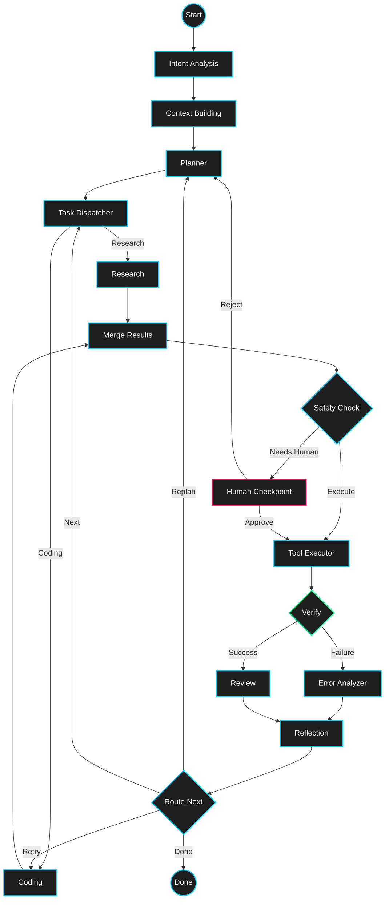

<div align="center">

# 🌌 Raman AGENT

[](https://www.python.org/downloads/)
[](https://python.langchain.com/docs/langgraph)
[](https://rich.readthedocs.io/)
[](https://opensource.org/licenses/MIT)

**Your fully autonomous, self-reflecting, cyberpunk AI Pair Programmer.**

[Features](#-features) • [Architecture](#-architecture) • [Getting Started](#-getting-started) • [Usage](#-usage)

---

</div>

Have you ever wanted an AI engineer that doesn't just write code, but **plans, researches, executes, and verifies** its own work—all while giving you a front-row seat to the action? 

Welcome to **Raman AGENT**. 

Powered by the blistering speed of NVIDIA's AI Endpoints (`gpt-oss-120b`) and orchestrated by a complex **LangGraph** state machine, Raman AGENT handles your toughest coding challenges autonomously. To top it off, you can watch it "think" via a jaw-dropping, custom-built terminal dashboard.

---

## ✨ Features

- 🧠 **Deep Agentic Workflow**: It doesn't just guess. It analyzes intent, builds context, dispatches tasks, researches, codes, and critically reflects on its own errors.
- 🛡️ **Human-in-the-Loop Safety**: Built-in safety checkpoints pause execution for human review before running potentially dangerous commands.
- 🎨 **State-of-the-Art Terminal UI**: Say goodbye to wall-of-text logs. Watch a gorgeous, split-pane `rich` dashboard update live as the graph navigates its nodes.
- ⚡ **Local & Modular**: Strictly separated frontend (`UI/`) and backend (`.agents_DONTOUCH/`) so you can tweak the interface without blowing up the agent logic.

---

## 🏗️ Architecture

How does Raman AGENT think? Below is the actual LangGraph orchestration that drives the brain of the operation.



---

## 🚀 Getting Started

### Prerequisites
You're going to need Python 3.9+ and an NVIDIA API key to unleash the power of the 120B model.

### 1. Installation
Clone the repo and install the cyber-deck dependencies:
```bash
git clone https://github.com/yourusername/raman-agent.git
cd raman-agent
pip install rich pyfiglet langchain_nvidia_ai_endpoints python-dotenv langgraph pydantic
```

### 2. Configuration
The backend requires an NVIDIA API key. Create a `.env` file inside the `.agents_DONTOUCH/` directory:
```env
NVIDIA_API_KEY="your-nvcf-api-key-here"
```

---

## 💻 Usage

Ready to pair program? Fire up the UI:

```bash
python UI/main.py
```

1. **The Dashboard**: You'll be greeted by the `pyfiglet` ansi-shadow banner. 
2. **The Prompt**: Type your request at the `❯` prompt. (e.g., *"Build a snake game in Python using pygame."*)
3. **The Show**: Sit back and watch the left-hand **Workflow Table** light up green as tasks complete, while the right-hand **Live Logs** stream the agent's internal thoughts directly to your terminal. 

To exit, simply type `/exit` or hit `Ctrl+C`.

---
<div align="center">
<i>"Code like a machine, design like an artist."</i><br>
Built with ❤️ and 🤖
</div>
